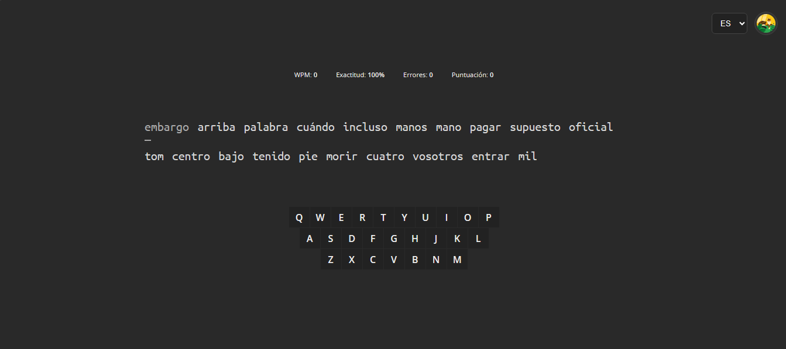
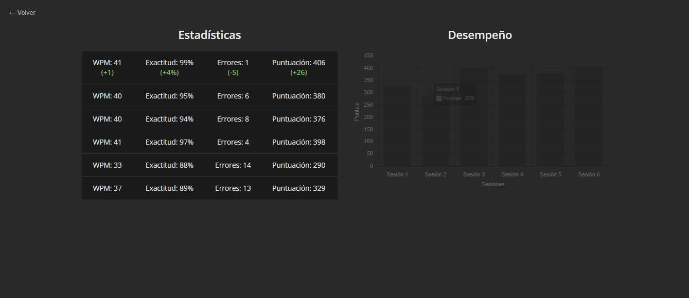

# Nonstop Typing App

Aplicación web para practicar mecanografía de forma continua, enfocada en mejorar velocidad, precisión y consistencia.

El proyecto permite realizar sesiones de escritura, registrar estadísticas y visualizar el progreso a lo largo del tiempo mediante gráficos.

## Funcionalidades

- Práctica de mecanografía en sesiones continuas
- Medición de WPM, precisión, errores y puntaje
- Historial de resultados por sesión
- Gráfico de barras con evolución del puntaje
- Autenticación de usuarios (login y registro)
- Soporte para múltiples idiomas
- Uso sin cuenta mediante almacenamiento local




## Tecnologías utilizadas

### Frontend
- React
- Vite
- React Router
- Chart.js
- CSS puro

### Backend
- Django
- Django REST Framework
- JWT para autenticación

## Estructura general

El frontend y el backend se manejan como proyectos separados:

- `nonstop-Frontend`: interfaz de usuario
- `nonstop-Backend`: API y persistencia de datos

## Instalación del frontend

```bash
git clone https://github.com/tu-usuario/nonstop-Frontend.git
cd nonstop-Frontend
npm install
npm run dev
```

La aplicación se ejecuta por defecto en: http://localhost:5173

## Uso con y sin backend

### Sin backend:
- La aplicación funciona en modo local
- Las estadísticas se guardan en localStorage
- No es necesario iniciar sesión

### Con backend activo:
- Se habilita el registro y el login
- Los resultados se guardan por usuario
- El historial se obtiene desde la API
- Endpoint esperado del backend: http://127.0.0.1:8000

## Estado del proyecto
Proyecto en desarrollo.
Las funcionalidades principales están implementadas y se continúa trabajando en mejoras visuales y nuevas métricas.

### Autor
Desarrollado por Leo.
